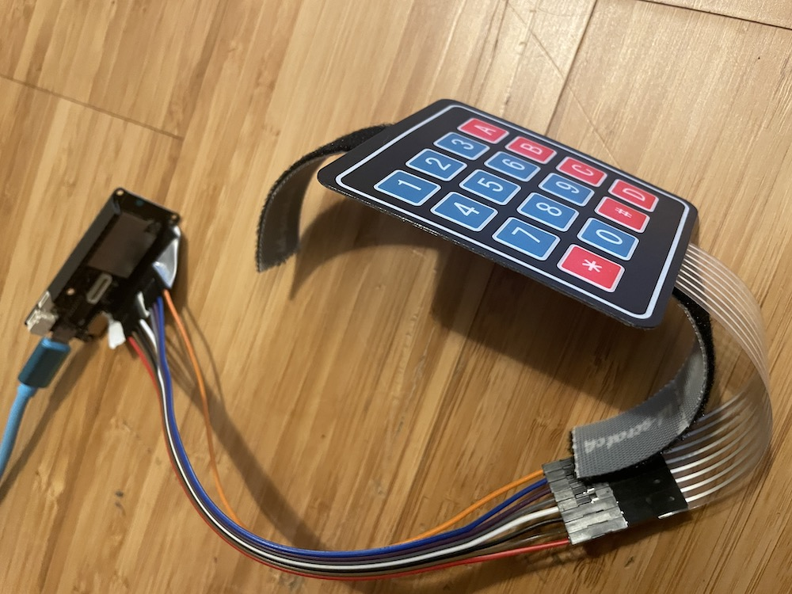

# Lolin keyboard emulator

This project allows to use a lolin D32 pro (esp32) as keyboard emulator by Bluetooth.  

It is tested on macbook pro 14'.  
It uses a keypad 16 buttons (4x4).  

  

## Installation

Connect lolin d32  
Open lolin-keyboard-emulator.ino in Arduino IDE  
Upload script  

## Notes

I needed to install:  

- 'BleKeyboard.h': see <https://github.com/T-vK/ESP32-BLE-Keyboard>  
- 'Keypad':  installed by Arduino IDE (tools | manage libraries | Keypad by Mark Stanley) 

An error occurs while compiling: Not found: ~/Documents/Arduino/hardware/espressif/esp32/tools/openocd-esp32/share/openocd/scripts/board/esp32-wrover-kit-3.3v.cfg  
To resolve it, I needed to:  

- install openocd:  
  ```git clone --recursive https://github.com/espressif/openocd-esp32.git``` in ~/Documents/Arduino/hardware/espressif/esp32/tools/

Copy ~/Documents/Arduino/hardware/espressif/esp32/tools/openocd-esp32/tcl/board/esp32-wrover-kit-3.3v.cfg to ~/Documents/Arduino/hardware/espressif/esp32/tools/openocd-esp32/share/openocd/scripts/board/esp32-wrover-kit-3.3v.cfg (create folders hierarchy)

see <https://demo-dijiudu.readthedocs.io/en/stable/api-guides/openocd.html#configuring-the-esp32-target-in-openocd> for more details

